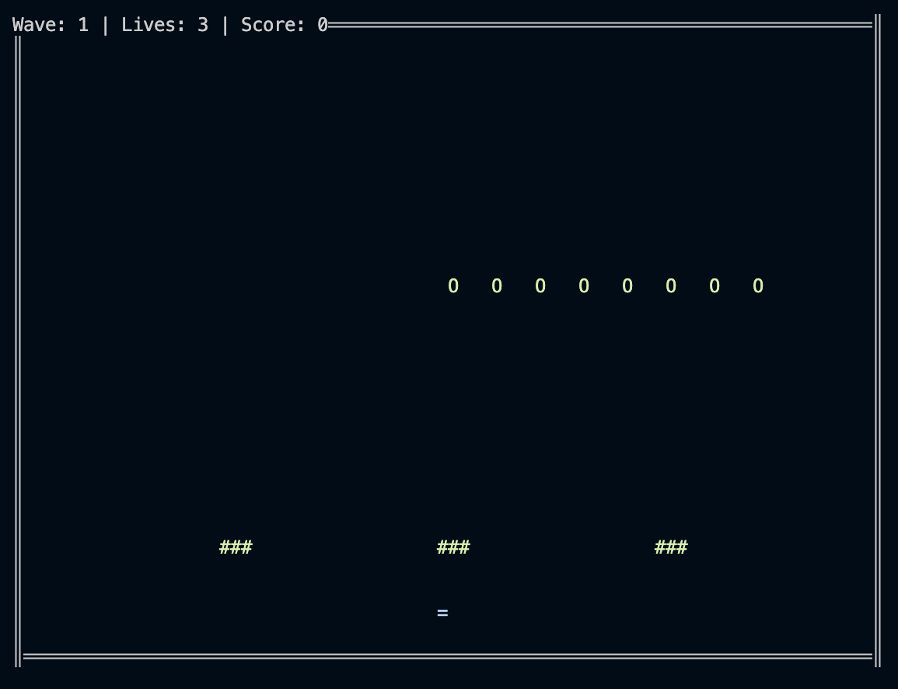

# Terminal Space Invaders

A simple terminal-based version of the classic "Space Invaders" game written in C++ using terminal ANSI codes for rendering graphics.

 <!-- Если есть скриншот -->

## Features

- 5 waves of enemies with increasing difficulty
- Player spaceship with shooting ability
- Enemy AI and shooting logic
- Explosions and barriers
- Score tracking and lives
- Pause functionality

## Requirements

- Linux or macOS (Windows WSL might work)
- GCC compiler with C++11 support or higher
- Make (optional)

## How to Build and Run

1. Clone the repository:
   ```bash
   git clone https://github.com/AnyNamePlease/Space-Invaders.git 
   cd Space-Invaders
2. Compile the project:
   ```bash
   clang++ SpaceInvaders.cpp -std=c++20 -stdlib=libc++ -o invaders
   ```
   or
   
   ```bash
   g++ SpaceInvaders.cpp -o invaders -std=c++20
4. Run the game:
   ```bash
   ./invaders
# Note

- if something goes wrong, use **reset** in terminal

## Classes Used

- `Entity`, `Player`, `Enemy`, `Bullet`, `Explosion`, `Barrier`, `Game`, `Terminal`

## Technologies I Used

- C++20 
- ANSI escape sequences
- Termios
- Unix/Linux terminal

## License

This project is under the Unlicensed license.
